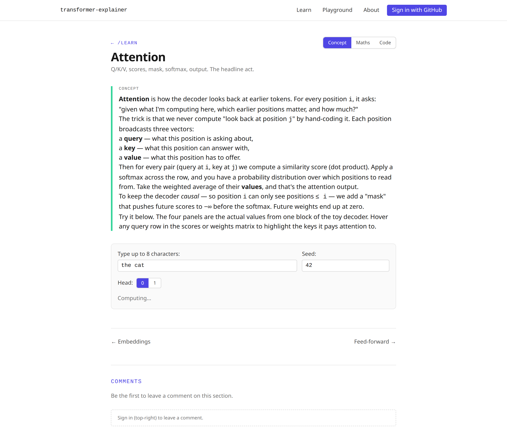
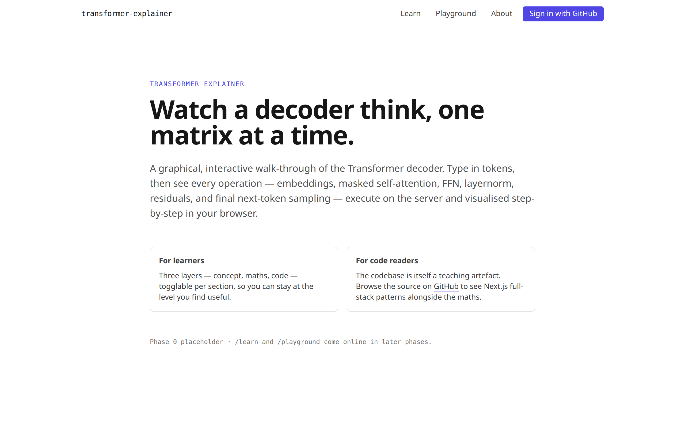
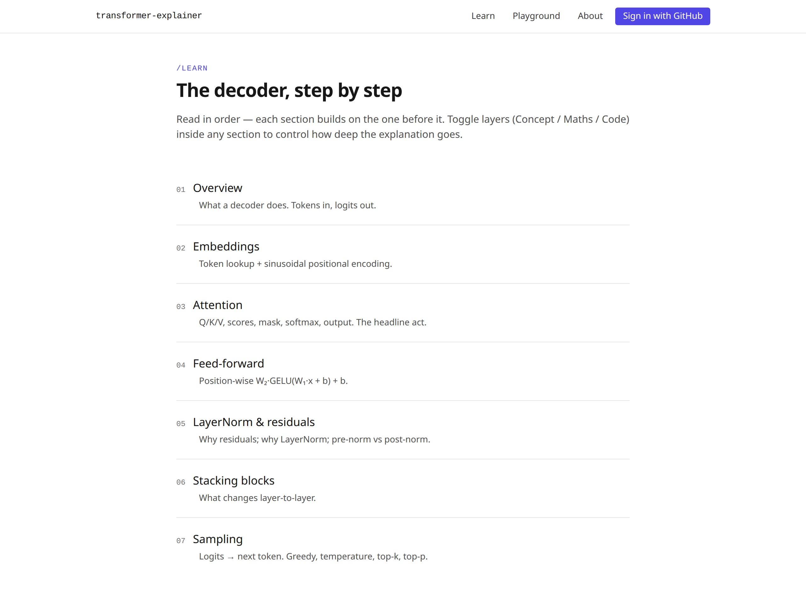
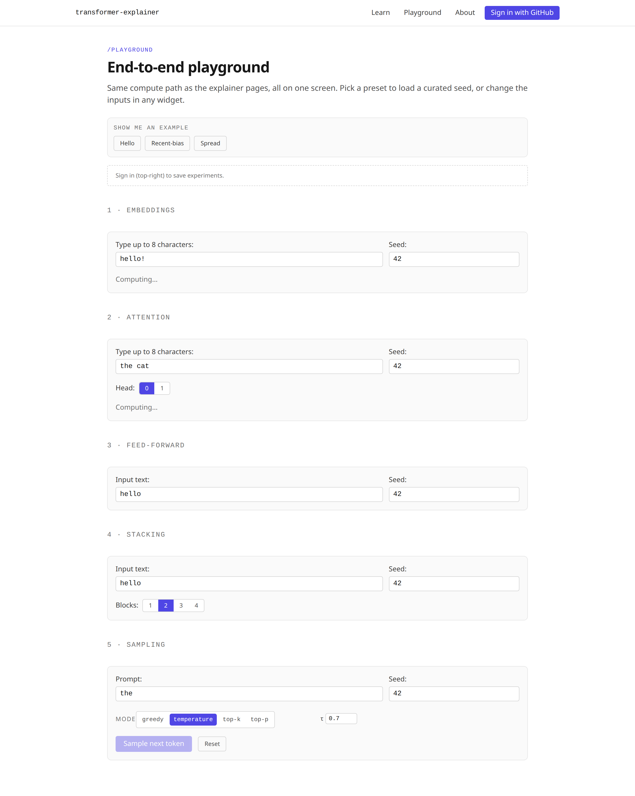
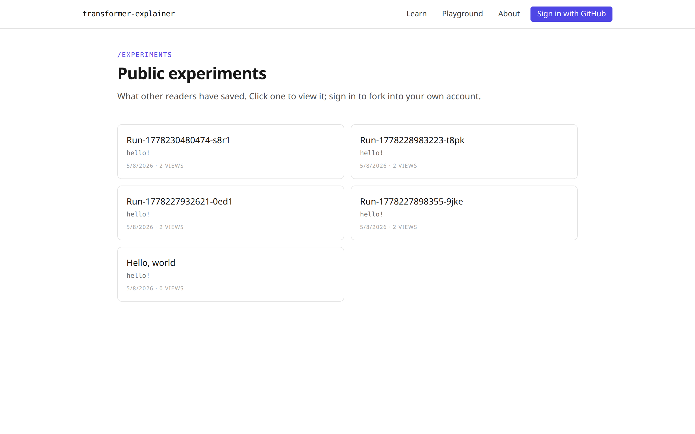
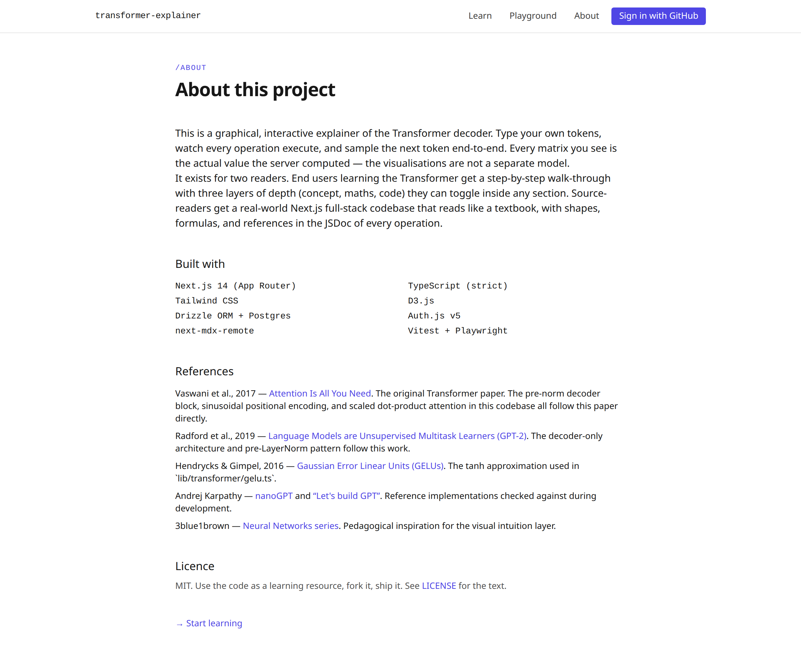

# Transformer Decoder Explainer

A graphical, interactive web explainer of the Transformer decoder. Type your
own tokens and watch every operation — embeddings, masked self-attention,
FFN, layer-norm, residuals, multi-block stacking, next-token sampling —
execute on the server and visualise step-by-step in the browser.

The codebase is itself a teaching artefact: a real-world Next.js 14 app with
strict TypeScript, Drizzle / Postgres, Auth.js, MDX content, D3
visualisations, and a pure-TypeScript transformer library that's verified
against PyTorch fixtures to within `1e-5`.



## What you can do

- Walk through the decoder one operation at a time at `/learn`.
- Toggle three layers — **Concept / Maths / Code** — inside any section to
  control how deep the explanation goes.
- Run the full pipeline end-to-end on `/playground` with named-seed presets.
- Sign in with GitHub to **save** a configuration as an experiment, share
  the URL, and let others **fork** it to their own account.
- Drop a comment on any section (Markdown, sanitised server-side).
- Track per-section progress automatically (scroll + interaction).

## Screenshots

|                                                     |                                                     |
| --------------------------------------------------- | --------------------------------------------------- |
|          |  |
|      |    |
|  |              |

Regenerate them with `pnpm dev` in one shell and `pnpm screenshots` in
another.

## Stack

- **Framework** — Next.js 14 (App Router) + TypeScript (strict)
- **Styling** — Tailwind CSS, Tailwind plugin for ESLint + Prettier
- **Database** — Postgres on Neon · Drizzle ORM
- **Auth** — Auth.js v5, GitHub OAuth in production, JWT credentials
  provider for E2E
- **Content** — MDX in `/content`, rendered via `next-mdx-remote/rsc`
- **Maths** — Pure TypeScript (`number[][]`), no PyTorch / WASM. Each op
  records into an optional `Trace` so the visualisations show the actual
  computed values.
- **Visualisation** — D3.js with React refs (no `react-d3` wrappers)
- **Testing** — Vitest (unit, 100% line coverage on `lib/transformer/`),
  Playwright (e2e, with axe-core a11y scans)
- **CI / deploy** — GitHub Actions, Vercel, Neon

## Local development

### Prerequisites

- Node ≥ 20.11
- pnpm ≥ 9 (the repo pins it via `packageManager`)
- A Postgres database. Either a local one (Docker) or a [Neon free-tier
  branch](https://neon.tech).
- Python 3.10+ with `torch` and `numpy` (only if you want to regenerate
  the numerical fixtures — the committed fixtures are enough for normal
  development).

### Quick start

```bash
git clone https://github.com/BrendanJamesLynskey/transformer-explainer
cd transformer-explainer
pnpm install
cp .env.example .env.local            # fill in the values below
pnpm db:push                          # apply the Drizzle schema
pnpm db:seed                          # idempotent seed (admin user, demo experiment)
pnpm dev                              # http://localhost:3000
```

### Environment variables

`.env.local` (never committed) needs:

| Variable               | Notes                                             |
| ---------------------- | ------------------------------------------------- |
| `DATABASE_URL`         | Postgres connection string. SSL required on Neon. |
| `AUTH_SECRET`          | `openssl rand -base64 32`                         |
| `AUTH_GITHUB_ID`       | GitHub OAuth app client id                        |
| `AUTH_GITHUB_SECRET`   | GitHub OAuth app client secret                    |
| `NEXT_PUBLIC_SITE_URL` | `http://localhost:3000` locally                   |
| `ADMIN_GITHUB_LOGINS`  | Comma-separated GitHub logins granted `/admin`    |
| `MAX_SEQ_LEN`          | `16` — server-side compute cap                    |
| `MAX_D_MODEL`          | `64`                                              |
| `MAX_BLOCKS`           | `4`                                               |

The full list lives in `.env.example`. Validation is done at boot in
`src/lib/env.ts` (Zod) — the app fails fast if anything is missing.

### GitHub OAuth app

[Create an OAuth app](https://github.com/settings/developers) with
**Authorization callback URL** set to
`http://localhost:3000/api/auth/callback/github` for local dev (and
`https://your-domain/api/auth/callback/github` for production).

## Deploy to Vercel

1. **Provision Neon.** Create a project on [neon.tech](https://neon.tech)
   and grab the production branch's `DATABASE_URL`.
2. **Push the schema.** From a machine with that URL set, run
   `pnpm db:push`.
3. **Vercel.** Import the GitHub repo on
   [vercel.com](https://vercel.com/new). Framework auto-detects as
   Next.js.
4. **Env vars on Vercel.** Add every variable in `.env.example` — copy
   the production values; in particular, set `NEXT_PUBLIC_SITE_URL` to
   your Vercel URL and rebuild.
5. **Production GitHub OAuth.** Update the OAuth app's callback URL to
   include your Vercel URL.
6. **Seed (optional).** From a machine with the prod `DATABASE_URL`,
   `pnpm db:seed`.

The first deploy from `main` will go live at the URL Vercel prints.
Subsequent merges deploy automatically; PR pushes get preview URLs.

## Testing

```bash
pnpm lint                  # ESLint + Tailwind plugin
pnpm typecheck             # tsc --noEmit
pnpm format:check          # Prettier --check
pnpm test                  # Vitest unit
pnpm test:coverage         # …with thresholds enforced (100% lines on lib/transformer/)
pnpm test:e2e              # Playwright (boots `pnpm dev` itself)
pnpm verify:maths          # cross-check TS ops vs. PyTorch fixtures
```

E2E runs against a real `pnpm dev` server with the seeded test database;
the harness toggles `E2E_TEST_AUTH=true` to enable a JWT credentials
provider so tests can sign in without GitHub. The a11y suite uses
`@axe-core/playwright` and fails on `serious`/`critical` violations.

## Regenerating numerical fixtures

The TypeScript transformer implementation is verified against PyTorch
fixtures committed in `tests/unit/fixtures/`. Regenerate with:

```bash
pip install torch numpy
python scripts/reference.py
git add tests/unit/fixtures/ && git commit -m "fixtures: regenerate"
```

`pnpm verify:maths` then re-runs the TS implementation against the new
JSON and reports the max abs-error per operation (target: `< 1e-5`).

## Project layout

```
content/decoder/          MDX sections
src/app/                  App Router routes (learn, playground, admin, api/*)
src/components/viz/       D3 charts (one file per concept)
src/components/interactive/  Widgets used inside MDX + on /playground
src/lib/transformer/      Pure-TS maths — file per operation
src/lib/db/               Drizzle schema + client
src/lib/auth/             Auth.js config + helpers
src/lib/analytics.ts      Event ingestion + admin aggregates
tests/unit/               Vitest, including PyTorch-fixture comparisons
tests/e2e/                Playwright + axe-core
scripts/                  seed-db, verify-maths, capture-screenshots, reference.py
```

## Architecture highlights

- **Trace-driven viz.** Every transformer op accepts an optional `Trace`
  argument and writes intermediate tensors into it. The compute API
  endpoints return the full trace; the client doesn't recompute, it
  visualises real values.
- **Server-rendered MDX.** Each `/learn/[slug]` page is a Server
  Component; the three-layer Concept / Maths / Code visibility is driven
  by `data-*` attributes on `<html>` and pure CSS, so the SEO-friendly
  HTML carries every layer.
- **Pre-norm decoder block** (`x → x + Attn(LN(x)); h → h + FFN(LN(h))`)
  matches GPT-2 conventions; sinusoidal positional encoding follows
  Vaswani 2017.
- **Monotonic progress upsert.** A SQL `CASE` clause prevents a returning
  visit from regressing a `completed` row to `in_progress`.
- **Anonymous-friendly analytics.** Events carry a stable `localStorage`
  session id, so DAU has a denominator without requiring auth.

## References

- Vaswani et al., 2017 — _[Attention Is All You
  Need](https://arxiv.org/abs/1706.03762)_
- Radford et al., 2019 — _[Language Models are Unsupervised Multitask
  Learners (GPT-2)](https://cdn.openai.com/better-language-models/language_models_are_unsupervised_multitask_learners.pdf)_
- Hendrycks & Gimpel, 2016 — _[Gaussian Error Linear Units
  (GELUs)](https://arxiv.org/abs/1606.08415)_
- Karpathy — _[nanoGPT](https://github.com/karpathy/nanoGPT)_ and _[Let's
  build GPT](https://www.youtube.com/watch?v=kCc8FmEb1nY)_

## Contributing

PRs welcome. The CI pipeline runs `lint`, `typecheck`, `format:check`,
`test`, `verify:maths`, and `test:e2e` against a service-container
Postgres. Coverage thresholds:

- `src/lib/transformer/`: **100% lines / functions / statements**, 80%
  branches.
- Other `src/lib/`: 80% across the board.

Read `CLAUDE.md` and `SPEC.md` for the conventions and full
implementation plan respectively.

## Licence

MIT — see [`LICENSE`](LICENSE). Use it as a learning resource, fork it,
ship it.
