# Transformer Decoder Explainer

A graphical, interactive web explainer of the Transformer decoder. Type your
own tokens and watch every operation — embeddings, masked self-attention,
FFN, layer-norm, residuals, multi-block stacking, next-token sampling —
execute on the server and visualise step-by-step in the browser.

The codebase is itself a teaching artefact: a real-world Next.js 14 app with
strict TypeScript, Drizzle / Postgres, Auth.js, MDX content, D3
visualisations, and a pure-TypeScript transformer library that's verified
against PyTorch fixtures to within `1e-5`.

**Live:** [transformer-decoder-explained.vercel.app](https://transformer-decoder-explained.vercel.app/)

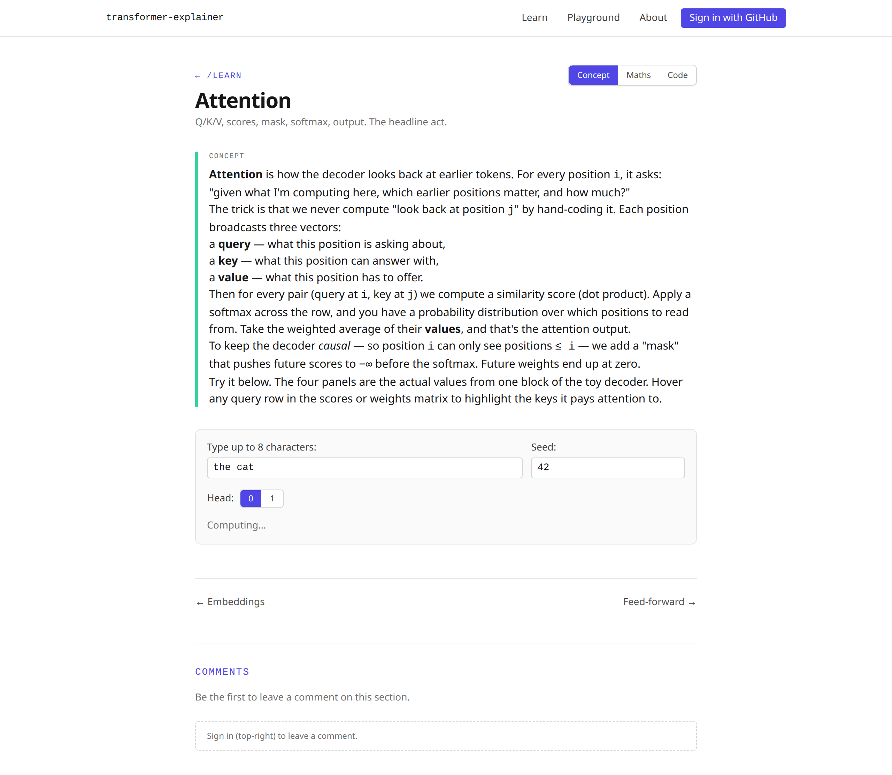

## Reading the codebase

If you're here to **learn backend engineering** from this repo, two
companion resources walk through every component for a junior engineer:

- 🎬 **[Launch presentation](https://brendanjameslynskey.github.io/transformer-explainer/)** —
  a slide-by-slide tour of the architecture, request lifecycle, database
  patterns, auth flow, API design, testing, CI/CD, and the six real
  production bugs we hit going live. Reveal.js, same style as the other
  decks in the [LLMs](https://github.com/BrendanJamesLynskey/LLMs) and
  [Software](https://github.com/BrendanJamesLynskey/Software) hubs.
- 📄 **[Backend engineering tour (PDF, 8 pages)](docs/reports/backend-tour.pdf)** —
  the longer-form version of the same material with code excerpts you
  can read alongside the source. Markdown source at
  [`docs/reports/backend-tour.md`](docs/reports/backend-tour.md);
  re-render with `pnpm tsx scripts/generate-report.ts <input.md> <out.pdf>`.

## Part of

This project sits in the [LLMs](https://github.com/BrendanJamesLynskey/LLMs)
hub (Transformer Architecture sub-area) and is referenced from the
[Software](https://github.com/BrendanJamesLynskey/Software) hub as a
full-stack reference application.

It is the first of a family of companion sites, linked from every page's
header in two groups. The "LLM systems" group (Decoder · Inference ·
Architectures · Kernels · Numerics · Silicon · Trade-offs):
[LLM Inference Explained](https://llm-inference-explained.vercel.app/)
shows how a model is served,
[LLM Architectures Explained](https://llm-architectures-explained.vercel.app/)
how real models' designs differ,
[GPU Kernels Explained](https://gpu-kernels-explained.vercel.app/)
how a GPU executes the maths,
[Numerics Explained](https://numerics-explained.vercel.app/)
the number formats and quantisation behind it,
[Systolic Arrays Explained](https://systolic-arrays-explained.vercel.app/)
the matrix hardware of TPUs, and
[Inference Trade-offs Explained](https://inference-tradeoffs-explained.vercel.app/)
which serving lever helps which metric. The "Agents" group starts with
[Agent Harnesses Explained](https://agent-harnesses-explained.vercel.app/),
the loop, tools, context and permissions that turn a model into an agent;
then [Agent Protocols Explained](https://agent-protocols-explained.vercel.app/),
MCP and A2A on the wire;
then [Agent Context Explained](https://agent-context-explained.vercel.app/),
retrieval, memory and context engineering; three more agent sites are marked "soon".

## What you can do

- Walk through the decoder one operation at a time at `/learn`.
- Toggle three layers — **Concept / Maths / Code** — inside any section to
  control how deep the explanation goes.
- Run the full pipeline end-to-end on `/playground` with named-seed presets,
  or step through generation one token at a time.
- Read the Maths layer as typeset equations (KaTeX), in light or dark
  mode (the site follows your system setting).
- Sign in with GitHub (at `/signin`) to **save** a configuration as an experiment, share
  the URL, and let others **fork** it to their own account.
- Drop a comment on any section (Markdown, sanitised server-side).
- Track per-section progress automatically (scroll + interaction).
- Watch each mechanism happen: chapters open with an animation driven by
  the model itself (play, pause, step, scrub, 0.25–4× speed, keyboard;
  captions read out to screen readers; no autoplay with reduced motion).

## Animations

Each frame is a state computed in your browser by the same TypeScript model
the API runs (`src/lib/compute/traces.ts` → `src/lib/anim/*-steps.ts`), on
your input. `scripts/reference.py` rebuilds every state independently with
PyTorch (float64, on the site's seeded weights) and the frame tests require
both to agree. Recorded with `pnpm animations` (WebM versions alongside, in
[`docs/media/`](docs/media/)):

|                                                                          |                                                                   |
| ------------------------------------------------------------------------ | ----------------------------------------------------------------- |
| 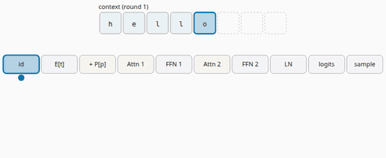 | 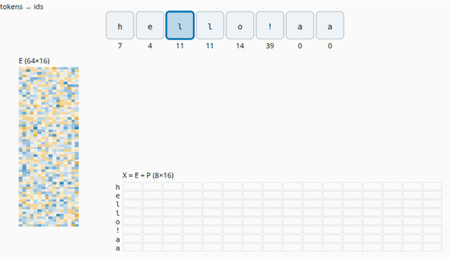        |
| 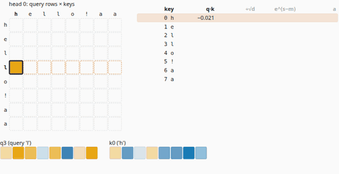          | 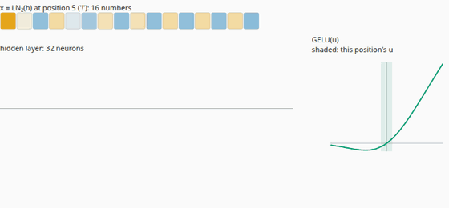            |
| 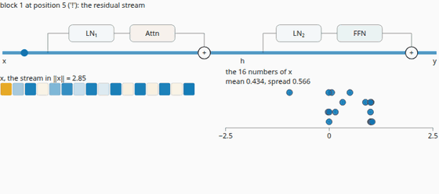           | 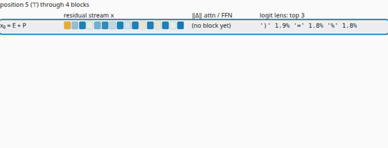 |
| 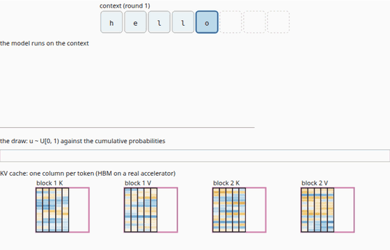   |                                                                   |

The seven chapters' animations: 01 one token's journey through the whole
decoder; 02 the embedding lookup and the positional add; 03 attention built
one query row at a time; 04 the feed-forward network neuron by neuron; 05
LayerNorm (mean, spread, centre, scale, γ and β) and the residual add; 06
the residual stream through 1–4 blocks with a logit lens after each; 07 the
generation loop (logits, temperature, top-k or top-p, a seeded draw,
append) with the KV cache growing a column per token. The playground's
"step through generation" runs the same loop.

The weights are random (seeded, N(0, 0.02), as at the start of training),
so the attention weights are nearly uniform and the next-token
probabilities nearly flat: the animations show the mechanism, not a trained
model's behaviour.

## Screenshots

|                                                     |                                                     |
| --------------------------------------------------- | --------------------------------------------------- |
| 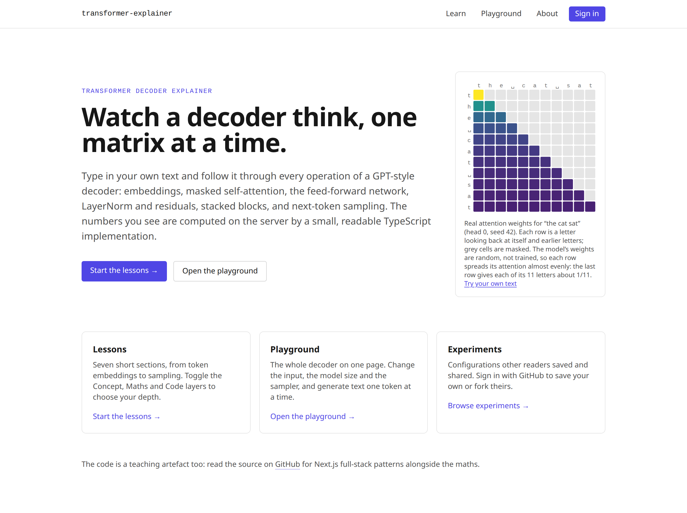         | 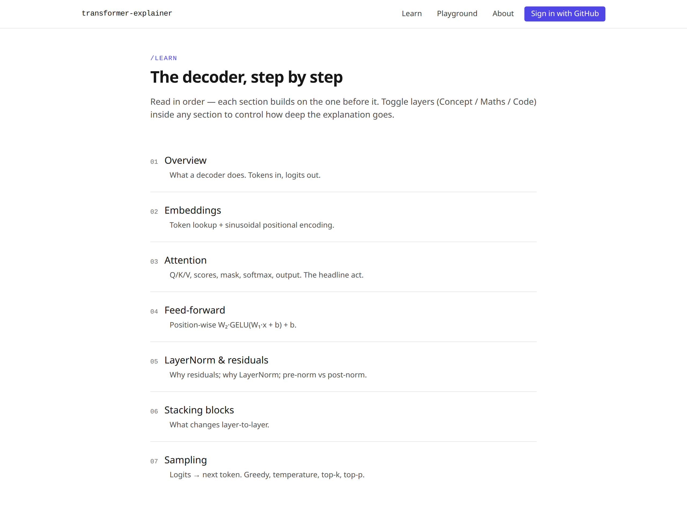 |
|      | 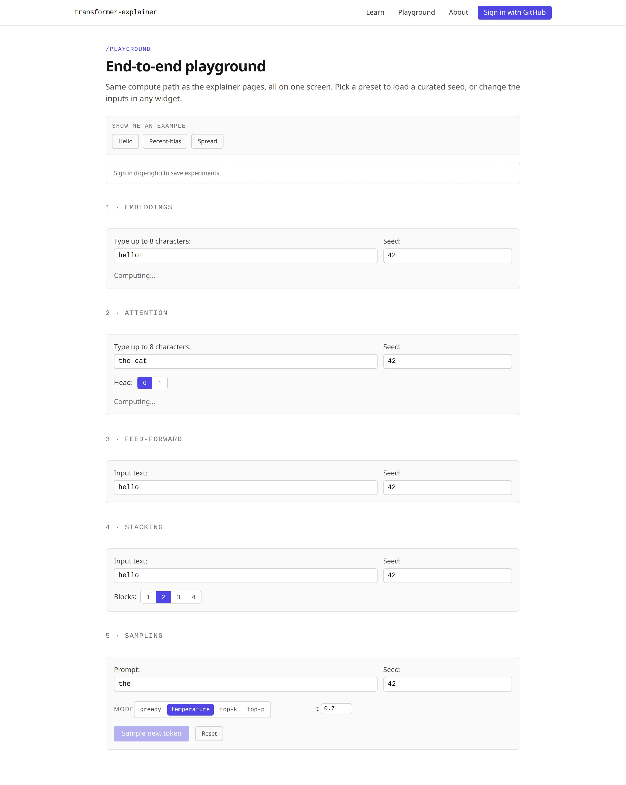   |
| 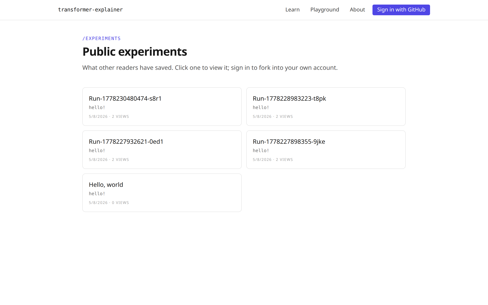 | 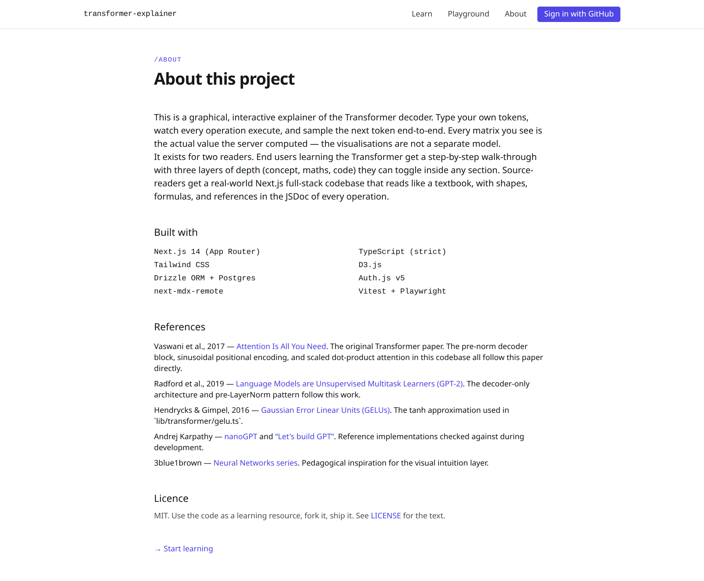             |

Regenerate them with `pnpm dev` in one shell and `pnpm screenshots` in
another.

## Stack

- **Framework** — Next.js 14 (App Router) + TypeScript (strict)
- **Styling** — Tailwind CSS, Tailwind plugin for ESLint + Prettier
- **Database** — Postgres on Neon · Drizzle ORM
- **Auth** — Auth.js v5, GitHub OAuth in production, JWT credentials
  provider for E2E
- **Content** — MDX in `/content`, rendered via `next-mdx-remote/rsc`
- **Maths** — Pure TypeScript (`number[][]`), no PyTorch / WASM. Each op
  records into an optional `Trace` so the visualisations show the actual
  computed values.
- **Visualisation** — D3.js with React refs (no `react-d3` wrappers)
- **Testing** — Vitest (unit, 100% line coverage on `lib/transformer/`),
  Playwright (e2e, with axe-core a11y scans)
- **CI / deploy** — GitHub Actions, Vercel, Neon

## Local development

### Prerequisites

- Node ≥ 20.11
- pnpm ≥ 9 (the repo pins it via `packageManager`)
- A Postgres database. Either a local one (Docker) or a [Neon free-tier
  branch](https://neon.tech).
- Python 3.10+ with `torch` and `numpy` (only if you want to regenerate
  the numerical fixtures — the committed fixtures are enough for normal
  development).

### Just want to see the explainer? (zero-config)

The compute pipeline and MDX content don't need a database or GitHub OAuth.
Run:

```bash
git clone https://github.com/BrendanJamesLynskey/transformer-explainer
cd transformer-explainer
pnpm install
cp .env.example .env.local            # placeholders are fine for read-only mode
pnpm dev                              # http://localhost:3000
```

Open `http://localhost:3000/learn`, walk through the seven sections, and
play with `/playground`. The DB-backed features (comments, progress,
saved experiments, admin) will silently no-op until you give them a real
database — they don't crash the page.

### Full setup (DB + auth)

If you want comments, saved experiments, and `/admin`, you need three
things — none take more than a couple of minutes:

1. **A Postgres database.** Create a [Neon free-tier
   branch](https://neon.tech) and copy its connection string. (Local
   Postgres / Docker also works.)
2. **An auth secret.** Run `openssl rand -base64 32` and copy the output.
3. **A GitHub OAuth app.** [Register
   one](https://github.com/settings/developers) with
   **Authorization callback URL** =
   `http://localhost:3000/api/auth/callback/github`. Copy the client id
   and secret.

Open `.env.local` and replace the placeholders:

```bash
DATABASE_URL=postgresql://your-real-neon-url
AUTH_SECRET=<output of openssl rand -base64 32>
AUTH_GITHUB_ID=<from GitHub OAuth app>
AUTH_GITHUB_SECRET=<from GitHub OAuth app>
ADMIN_GITHUB_LOGINS=<your-github-login>
```

Then push the schema, seed, and start the dev server:

```bash
pnpm db:push                          # apply the Drizzle schema to your DB
pnpm db:seed                          # idempotent seed (admin user, demo experiment)
pnpm dev                              # http://localhost:3000
```

### Environment variables

`.env.local` is auto-loaded by Next.js, drizzle-kit (via `drizzle.config.ts`),
and the seed script. Full list:

| Variable               | Notes                                             |
| ---------------------- | ------------------------------------------------- |
| `DATABASE_URL`         | Postgres connection string. SSL required on Neon. |
| `AUTH_SECRET`          | `openssl rand -base64 32`                         |
| `AUTH_GITHUB_ID`       | GitHub OAuth app client id                        |
| `AUTH_GITHUB_SECRET`   | GitHub OAuth app client secret                    |
| `NEXT_PUBLIC_SITE_URL` | `http://localhost:3000` locally                   |
| `ADMIN_GITHUB_LOGINS`  | Comma-separated GitHub logins granted `/admin`    |
| `MAX_SEQ_LEN`          | `16` — server-side compute cap                    |
| `MAX_D_MODEL`          | `64`                                              |
| `MAX_BLOCKS`           | `4`                                               |

`src/lib/env.ts` validates with Zod at boot. In production all secrets
are required; in development they're optional and the app degrades
gracefully (DB-backed features silently no-op, see `lib/db-fallback.ts`).
Because that fallback is silent, `GET /api/health` reports whether the
database answers and whether it has every migration in `drizzle/`
(HTTP 503 if not), and `/admin` shows the same check plus a count of
fallbacks served.

## Deploy to Vercel

1. **Provision Neon.** Create a project on [neon.tech](https://neon.tech)
   and grab the production branch's `DATABASE_URL`.
2. **Push the schema.** From a machine with that URL set, run
   `pnpm db:push`.
3. **Vercel.** Import the GitHub repo on
   [vercel.com](https://vercel.com/new). Framework auto-detects as
   Next.js.
4. **Env vars on Vercel.** Add every variable in `.env.example` — copy
   the production values; in particular, set `NEXT_PUBLIC_SITE_URL` to
   your Vercel URL and rebuild.
5. **Production GitHub OAuth.** Update the OAuth app's callback URL to
   include your Vercel URL.
6. **Seed (optional).** From a machine with the prod `DATABASE_URL`,
   `pnpm db:seed`.
7. **Smoke-check.** `pnpm smoke https://<your-vercel-url>` checks
   `/api/health`, every public page and one section's comment list (it
   needs a visible comment; `--comments-section <slug|none>` picks the
   section), and exits non-zero on any failure.

The first deploy from `main` will go live at the URL Vercel prints.
Subsequent merges deploy automatically; PR pushes get preview URLs.

**Every later deploy that changes the schema:** run `pnpm db:migrate`
against production _before_ deploying, then `pnpm smoke` after. The full
checklist the live site uses is in [`RUNBOOK.md` §7](RUNBOOK.md).

## Testing

```bash
pnpm lint                  # ESLint + Tailwind plugin
pnpm typecheck             # tsc --noEmit
pnpm format:check          # Prettier --check
pnpm test                  # Vitest unit
pnpm test:coverage         # …with thresholds enforced (100% lines on lib/transformer/)
pnpm test:e2e              # Playwright (boots `pnpm dev` itself)
pnpm verify:maths          # cross-check TS ops vs. PyTorch fixtures
pnpm lighthouse            # Lighthouse CI on a `pnpm build` (needs Chrome)
pnpm smoke <url>           # post-deploy check of /api/health, every page, a comment list
```

E2E runs against a real `pnpm dev` server with the seeded test database;
the harness toggles `E2E_TEST_AUTH=true` to enable a JWT credentials
provider so tests can sign in without GitHub. The a11y suite uses
`@axe-core/playwright` and fails on `serious`/`critical` violations.

## Regenerating numerical fixtures

The TypeScript transformer implementation is verified against PyTorch
fixtures committed in `tests/unit/fixtures/`. Regenerate with:

```bash
pip install torch numpy
python scripts/reference.py
git add tests/unit/fixtures/ && git commit -m "fixtures: regenerate"
```

`pnpm verify:maths` then re-runs the TS implementation against the new
JSON and reports the max abs-error per operation (target: `< 1e-5`).

The same script also writes `tests/unit/fixtures/animations.json`: the
animations' states, built from a Python port of the site's seeded
initialiser (mulberry32 + Box–Muller) and the PyTorch ops above in
float64. `tests/unit/anim-frames.test.ts` and
`tests/e2e/anim-frames.spec.ts` compare the site's frames with it. Brief
27B's animations (chapters 05–07) have their own file,
`tests/unit/fixtures/animations_b.json`, with its own ports of the
sampler's top-k and top-p masks, checked by `anim-frames-b.test.ts` and
`anim-frames-b.spec.ts`. The other fixtures come out byte-identical when it
is re-run.

## Project layout

```
content/decoder/          MDX sections
src/app/                  App Router routes (learn, playground, admin, api/*)
src/components/viz/       D3 charts (one file per concept)
src/components/interactive/  Widgets used inside MDX + on /playground
src/lib/transformer/      Pure-TS maths — file per operation
src/lib/db/               Drizzle schema + client
src/lib/auth/             Auth.js config + helpers
src/lib/analytics.ts      Event ingestion + admin aggregates
tests/unit/               Vitest, including PyTorch-fixture comparisons
tests/e2e/                Playwright + axe-core
scripts/                  seed-db, verify-maths, capture-screenshots, reference.py
```

## Architecture highlights

- **Trace-driven viz.** Every transformer op accepts an optional `Trace`
  argument and writes intermediate tensors into it. The compute API
  endpoints return the full trace; the client doesn't recompute, it
  visualises real values.
- **Server-rendered MDX.** Each `/learn/[slug]` page is a Server
  Component; the three-layer Concept / Maths / Code visibility is driven
  by `data-*` attributes on `<html>` and pure CSS, so the SEO-friendly
  HTML carries every layer. The Maths layer is LaTeX, rendered by
  `remark-math` + `rehype-katex` on the server, so no KaTeX JavaScript
  reaches the browser.
- **A landing page with no client JavaScript of its own.** The attention
  heatmap on `/` is computed on the server by `lib/transformer` (the same
  path as `/api/compute/attention`) and drawn as static SVG.
- **Pre-norm decoder block** (`x → x + Attn(LN(x)); h → h + FFN(LN(h))`)
  matches GPT-2 conventions; sinusoidal positional encoding follows
  Vaswani 2017.
- **Monotonic progress upsert.** A SQL `CASE` clause prevents a returning
  visit from regressing a `completed` row to `in_progress`.
- **Anonymous-friendly analytics.** Events carry a stable `localStorage`
  session id, so DAU has a denominator without requiring auth. Comments
  and progress updates are recorded by the server (`comment_post`,
  `progress_update`) under the same session id, so `/admin` counts what
  was actually stored.
- **Health check that refuses to fall back.** `/api/health` is the one DB
  read that doesn't go through `runOrFallback`; it compares
  `drizzle.__drizzle_migrations` with `drizzle/meta/_journal.json` and
  returns only statuses and error codes, never connection details.

## References

- Vaswani et al., 2017 — _[Attention Is All You
  Need](https://arxiv.org/abs/1706.03762)_
- Radford et al., 2019 — _[Language Models are Unsupervised Multitask
  Learners (GPT-2)](https://cdn.openai.com/better-language-models/language_models_are_unsupervised_multitask_learners.pdf)_
- Hendrycks & Gimpel, 2016 — _[Gaussian Error Linear Units
  (GELUs)](https://arxiv.org/abs/1606.08415)_
- Karpathy — _[nanoGPT](https://github.com/karpathy/nanoGPT)_ and _[Let's
  build GPT](https://www.youtube.com/watch?v=kCc8FmEb1nY)_

## Contributing

PRs welcome. The CI pipeline runs `lint`, `typecheck`, `format:check`,
`test`, `verify:maths`, and `test:e2e` against a service-container
Postgres, plus Lighthouse CI, which fails if performance, accessibility or
best practices scores below 90 on `/`, `/learn` or `/learn/03-attention`.
`main` is branch-protected: those checks must pass before a change lands.
Coverage thresholds:

- `src/lib/transformer/`: **100% lines / functions / statements**, 80%
  branches.
- Other `src/lib/`: 80% across the board.

Read `CLAUDE.md` and `SPEC.md` for the conventions and full
implementation plan respectively.

## Licence

MIT — see [`LICENSE`](LICENSE). Use it as a learning resource, fork it,
ship it.
